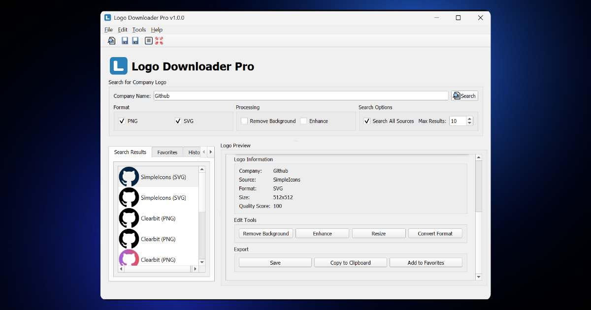
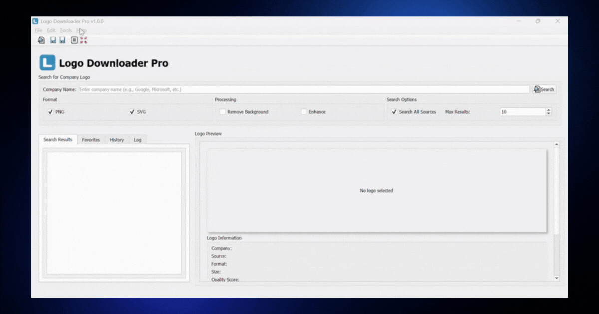

# Logo Downloader Pro


A professional tool for searching, downloading, and managing company logos with advanced features.



## Features

- **Advanced Logo Search**: Search for company logos across multiple sources
- **Multiple Formats**: Download logos in PNG and SVG formats
- **Background Removal**: Automatically remove backgrounds from logos
- **Logo Enhancement**: Improve logo quality with built-in enhancement tools
- **Favorites Management**: Save and organize your favorite logos
- **Search History**: Keep track of your previous searches
- **Batch Processing**: Download multiple logos at once



## Installation

### Prerequisites

- Python 3.8 or higher
- PyQt5
- Required Python packages (see requirements.txt)

### Setup

1. Clone the repository:
```bash
git clone https://github.com/Mizokuiam/Logo-Downloader-Pro.git
cd Logo-Downloader-Pro
```

2. Install dependencies:
```bash
pip install -r requirements.txt
```

3. Run the application:
```bash
python logo_downloader.py
```

## Usage

1. Enter a company name in the search field
2. Select desired formats (PNG, SVG)
3. Configure processing options (background removal, enhancement)
4. Click "Search" to find logos
5. Preview and download selected logos
6. Add favorites for quick access later

## Optional Features

The application supports several optional features depending on available packages:

- **CairoSVG**: Enhanced SVG processing
- **OpenCV**: Advanced image processing
- **Rembg**: AI-powered background removal

## Contributing

Contributions are welcome! Please feel free to submit a Pull Request.

## License

This project is licensed under the MIT License - see the [LICENSE](LICENSE) file for details.

## Acknowledgments

- [Clearbit](https://clearbit.com/) for logo API
- [PyQt5](https://www.riverbankcomputing.com/software/pyqt/) for the UI framework
- [Rembg](https://github.com/danielgatis/rembg) for background removal capabilities
